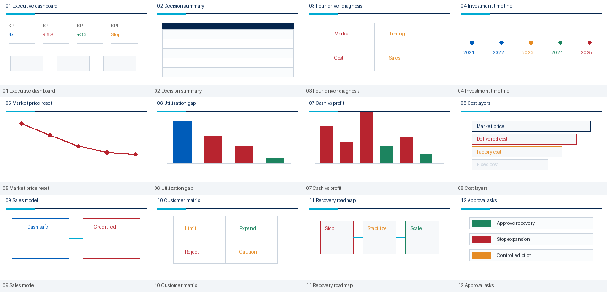
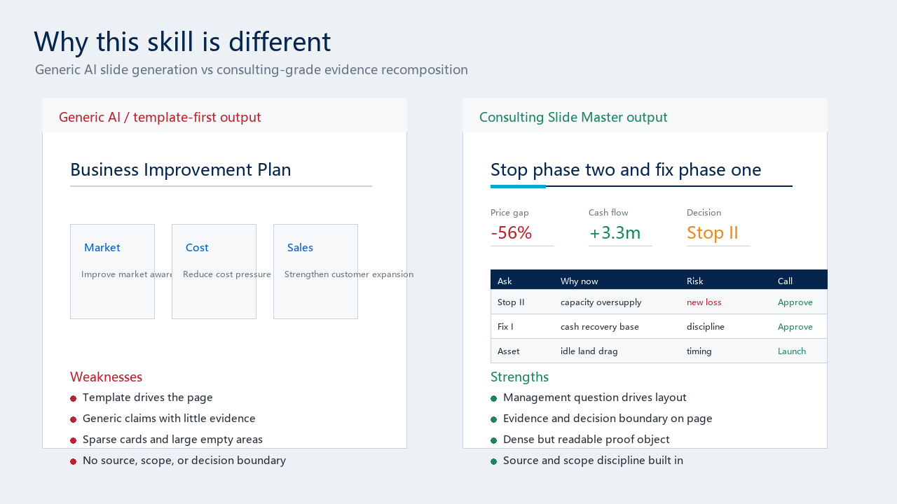

# Consulting Slide Master

Most AI presentation tools start from a prompt or a template.

**Consulting Slide Master starts from the management question.**

It is a consulting-grade skill for turning complex business materials into high-density executive PowerPoint decks. It combines consulting-style reasoning, evidence-to-claim workflows, McKinsey/BCG-inspired visual systems, a decomposed library architecture for **10,000+ PPT components**, content-driven layout recomposition, and rendered contact-sheet QA.

This is not a generic slide generator and not a template pack. It is a method and workflow for producing business decks that can survive executive scrutiny.

## Why This Exists

Many AI slide tools are fast, but they often fail at serious executive decks:

- They summarize documents instead of diagnosing management problems.
- They decorate slides instead of proving claims.
- They choose a template before understanding the business question.
- They generate sparse card layouts that look polished but say little.
- They struggle with dense Chinese executive reporting and data-heavy business materials.
- They rarely render the full deck and inspect it visually before delivery.

Consulting Slide Master is built for the opposite workflow:

> Evidence first. Claim first. Proof first. Component recomposition second.

## What Makes It Different

| Capability | Generic AI PPT tools | Template libraries | Consulting Slide Master |
|---|---|---|---|
| Starting point | Prompt or topic | A selected template | Management question |
| Thinking model | Generic outline | None | Consulting claim spine |
| Source handling | Light summary | User-filled | Evidence library with source discipline |
| Template use | One visual theme | Full-slide reuse | 10,000+ decomposed components |
| Layout logic | Template-driven | Template-driven | Content-driven recomposition |
| Slide title | Often descriptive | Template placeholder | Conclusion sentence |
| Chart role | Decoration or simple chart | Static style | Proof object for the claim |
| Density | Often sparse | Depends on template | High-density executive style |
| Color system | Theme-dependent | Template-dependent | Consulting blue-gray system |
| QA | Export only | Manual check | Rendered contact-sheet review |
| Best use | Quick drafts | Visual reuse | Boardroom-ready business decks |

## Component Library Scale

This skill is designed around a decomposed PPT component library rather than fixed slide templates.

Sanitized local indexing statistics:

| Indexed asset | Count |
|---|---:|
| Professional template decks | 19 |
| Indexed slides | 642 |
| Indexed PPT objects | 36,935 |
| Top-level objects | 23,322 |
| Group-child objects | 13,613 |
| Reusable component candidates | 8,975 |

The public repository includes schemas, taxonomy, and sanitized samples only. It does not include private, licensed, or client-specific template assets.

## Core Philosophy

### Consulting Thinking First

The skill does not start by asking which template to use. It asks:

- What decision must the audience make?
- What management question does each slide answer?
- What claim must be proven?
- What evidence supports that claim?
- What layout best proves the claim?

### Templates Are Decomposed, Not Obeyed

Professional templates are valuable, but full-slide template reuse often traps the message. Consulting Slide Master treats templates as component libraries.

The component architecture is designed for full decomposition of professional PPT decks into reusable objects, including:

- title headers
- KPI strips
- metric cards
- comparison tables
- ledger tables
- timelines
- roadmaps
- decision matrices
- issue trees
- causal chains
- bridge chart frames
- dashboard strips
- callouts
- source notes
- process flows
- hierarchy layers

Instead of forcing content into one fixed theme, the skill searches component roles and recomposes pages based on the actual content.

### Every Slide Is A Proof Unit

Each slide should have:

1. A management question
2. A conclusion-led title
3. One primary proof object
4. Supporting evidence
5. Implication or action
6. Source, unit, date, and scope notes

## Typical Use Cases

- Strategy review decks
- Operating review decks
- Board materials
- Investment committee materials
- Post-investment evaluation
- Turnaround and recovery plans
- Cost reduction programs
- Market research reports
- Business diagnosis decks
- Sales and customer strategy
- Asset disposal and restructuring proposals
- Monthly or quarterly executive business reviews

## Sanitized Example

The repository includes a fictional turnaround case under [`examples/turnaround-plan`](examples/turnaround-plan/). It demonstrates how the skill organizes a business recovery deck without exposing any private company information.

Example artifacts:

- [`sample-evidence-library.md`](examples/turnaround-plan/sample-evidence-library.md)
- [`sample-page-plan.md`](examples/turnaround-plan/sample-page-plan.md)
- [`sample-quality-report.md`](examples/turnaround-plan/sample-quality-report.md)
- [`demo-deck/fictional-turnaround-demo.pptx`](examples/turnaround-plan/demo-deck/fictional-turnaround-demo.pptx)
- [`demo-deck/contact_sheet.jpg`](examples/turnaround-plan/demo-deck/contact_sheet.jpg)
- [`sample-contact-sheet.png`](examples/turnaround-plan/sample-contact-sheet.png), copied from the rendered demo contact sheet for README preview
- [`before-after-comparison.png`](examples/turnaround-plan/before-after-comparison.png)

Preview:



Before vs after:



## Output Contract

A complete run should produce:

- editable `.pptx`
- evidence library
- claim spine or page plan
- rendered slide previews
- contact sheet
- quality report
- optional speaker notes, leadership Q&A, and data-gap list

## Repository Structure

```text
consulting-slide-master/
├─ SKILL.md
├─ manifest.json
├─ agents/
│  └─ openai.yaml
├─ references/
│  ├─ consulting-thinking-method.md
│  ├─ evidence-to-claim-workflow.md
│  ├─ page-proof-model.md
│  ├─ content-to-layout-decision-tree.md
│  ├─ consulting-color-system.md
│  ├─ density-and-hierarchy-rules.md
│  ├─ chart-table-evidence-rules.md
│  ├─ anti-template-patterns.md
│  └─ contact-sheet-qa.md
├─ component-library/
│  ├─ component-taxonomy.md
│  ├─ template-inventory.schema.json
│  ├─ component-index.schema.json
│  ├─ sample-component-index.json
│  └─ role-contact-sheets/
├─ scripts/
│  ├─ make_contact_sheet.py
│  ├─ inspect_pptx.py
│  └─ validate_deck_quality.py
├─ templates/
│  ├─ mckinsey-blue-gray.json
│  ├─ bcg-deep-blue.json
│  └─ consulting-layout-patterns.json
├─ evals/
│  ├─ trigger_cases.json
│  ├─ layout_selection_cases.json
│  ├─ anti_pattern_cases.json
│  └─ quality_rubric.json
└─ examples/
   ├─ executive-summary/
   ├─ operating-review/
   └─ component-recomposition-demo/
```

## Quick Start

Use this skill when the user asks for an executive-ready business deck and provides complex source materials.

Recommended workflow:

1. Read `SKILL.md`.
2. Build an evidence library from source materials.
3. Convert evidence into a claim spine.
4. Select page proof structures.
5. Search or reference component roles.
6. Recompose page-specific layouts.
7. Apply the consulting visual system.
8. Build the deck.
9. Render previews.
10. Generate a contact sheet.
11. Revise weak slides before delivery.

## Market Position

Consulting Slide Master is not competing as another "beautiful slides in seconds" tool.

It is for users who need:

- serious management materials
- dense evidence-backed pages
- consulting-style storylines
- editable PowerPoint output
- source discipline
- non-template page rhythm
- executive-level decision clarity

Tagline:

> From messy materials to boardroom-ready decisions.
